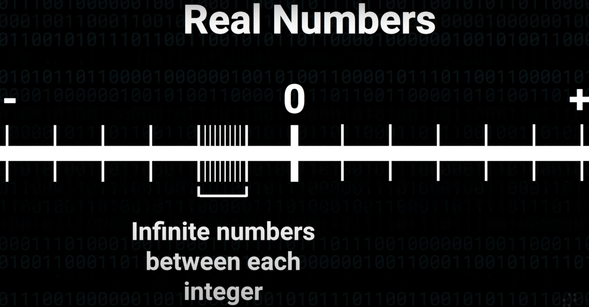

# Floating point number JavaScript Issue of IEEE 754

## Original tiny article link with LateX support - [click](https://nutritious-larch-59b.notion.site/Floating-point-number-JavaScript-Issue-of-IEEE-754-b7392ade15904125b225b3d0b2d3eeb8)

## Theses:

- The idea of floating point numbers is that we have to compress a certain number range to a smaller one. We have to move from an **infinite** to a **finite** system so to say.

- But no matter how many bits we have, there will **always** be gaps!
- **IEEE 754 -** is a compression algorithm that used to compress or describe possibly infinite floating point number in the finite system. ****

## Let’s design a 16-bit floating point number system:

- **Sign** - takes up 1 bit, indicates +- sign (who would doubt that?)
- **Exponent** - takes up 5 bits, signifies the integer power to which the radix (number system base) is raised. In our case 2, e.g. $2^5$ if exponent is 5 in binary.
- **Mantissa** - it’s like our magnifying glass which we zoom in with to determine the exact location of our number in the **-Infinity to +Infinity** interval.

## Let’s explain a floating point number 12.52571 using 16 bit system:

1. Since exponent represents the power we have to raise our radix to, we can represent each power range with a corresponding numerical integer range (take a look at the picture below)

    
    So far, we’re modeling a 16-bit system, where 5 bits are dedicated for exponent, which means we can hold 32 numbers in that exponent position, or using a sign from $[-16, 15]$
    
    ($2^N, where\;N\;-\;number\;of\;bits)$

2. As we’ve selected **12.52571**, the whole-part of the number falls into the range of  $[8, 16]$.

   Exponent range - $[3, 4]$

   Numerical range - $[8, 16]$

   Exponent - 3

   Then we basically have to somehow zoom in our interval to the corresponding number.

   

   We have to figure out where in this range the aforementioned number is placed **using percentage**. **That’s where Mantissa comes in!**

3. In order to calculate percentage of our number in the numerical range we’re gonna normalise it!

   Normalisation formula:

   $$
   N = \frac{value - min}{max - min}
   $$

   In our case:

   $$
   N = \frac{12.52571 - 8}{16 - 8} = 0.56571375 \; or \; 56.571375 \% \; into\;the\;range
   $$

   Basically, we can use our exponent and the percentage to calculate the exact position of our number in the range.

   E.g:

   $$
   N = 8 * (1 + 0.56571375) = 12.52571
   $$

4. The question left intact is how do we actually encode that percentage into a binary format?

   For Mantissa we have only 10 bits available:

   **10 bits** are **1024** possible numbers, so we can point out a closest whole number corresponding to **56.571375%:**

   $$
   N = 0.56571375 * 1024 = 579.29088
   $$

   $$
   round(579.29088) = 579
   $$

   Therefore, 579 can be represented as **1001000011** in the binary format, BUT!

   This is ***exactly*** the step when we **performed our compression** and lost some **precision**!

   If try to conduct this operation in the opposite way: $579 / 1024 = 0.5654296875$ and then try to replicate the number:

   $$
   8 * (1 + 0.5654296875) = 12.5234375
   $$

   As you can see **12.5234375 ≠ 12.52571**

   

   Actual formula to decode floating point number using exponent, sign and mantissa:

   

Special thanks to the author of the original [video](https://youtu.be/wPBjd-vb9eI).